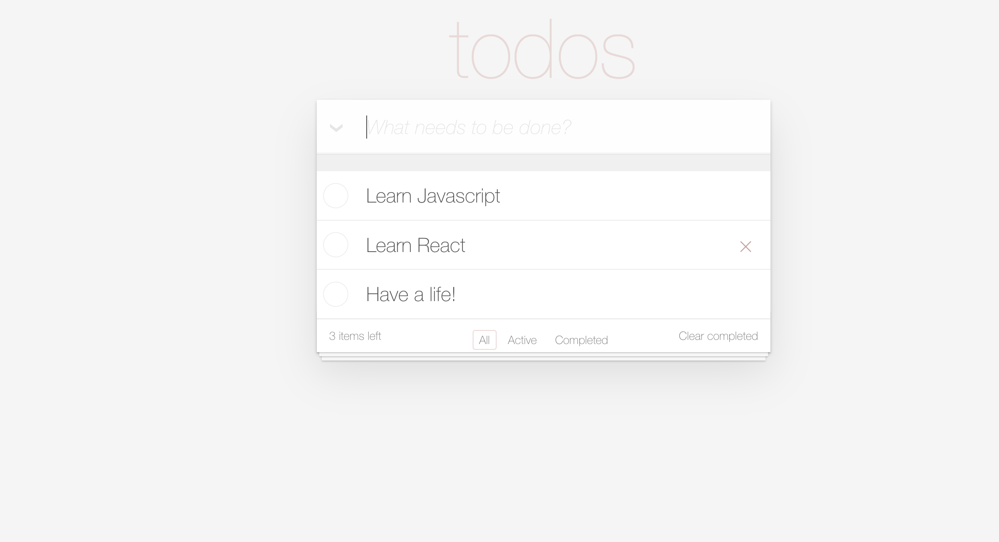

# Todo List Web App

This is a simple web application built with ReactJS that allows users to create and manage their to-do list. The application allows users to mark a task as completed, delete a task, and filter tasks based on their status.

## Try it out!
https://godricpursue.github.io/todo-app/

## Features

- Add new task to the list
- Edit any task
- Mark a task as completed
- Delete a task from the list
- Filter tasks based on their status: all, active, or completed
- Show the number of active tasks remaining in the list

## Components

The application is built using four main components:

- **Heading:** This component displays the title of the to-do list.
- **List:** This component displays the list of tasks. It allows users to mark a task as completed, delete a task, and edit the task name.
- **AllSelected:** This component allows users to filter the list of tasks by selecting either all, active, or completed tasks.
- **Footer:** This component displays the number of active tasks remaining in the list.

## Technologies Used

- ReactJS
- React Hooks (useState and useEffect)

## Getting Started

To get started with the application, clone the repository and install the dependencies by running the following command:

`npm install`

After installing the dependencies, start the application by running the following command:

`npm start`

The application will start running on http://localhost:3000.

## 

## 

## 

## 

## 
